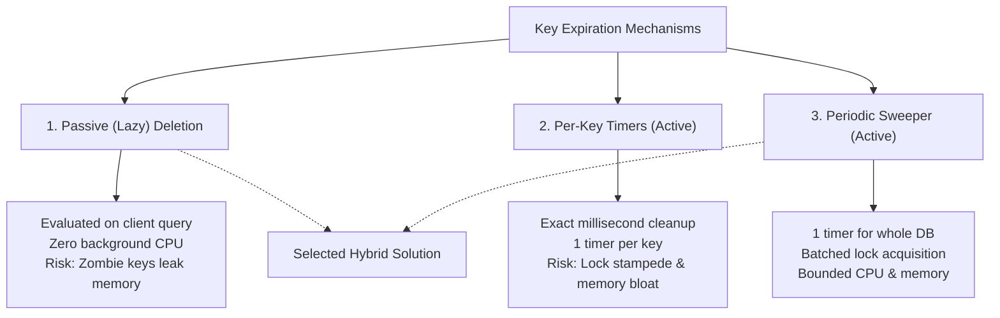

# Architecture Design Document: Key Expiration Strategies in Redis

**Author:** Redis in Go Engineering  
**Subject:** In-Memory Key Expiration Architecture & Trade-Off Analysis  
**Status:** Approved / Decision Record  

---

## 1. Executive Summary

In-memory key-value stores (such as Redis) must support Time-To-Live (TTL) expiration (`EX`, `PX`). When a key's TTL expires, it must be rendered inaccessible to clients, and its allocated memory must be reclaimed. 

This document evaluates three potential expiration mechanisms:
1. **Passive (Lazy) Deletion on Read** (`Get()`)
2. **Active Per-Key Timers** (`time.AfterFunc`)
3. **Active Periodic Background Sweeping** (`time.Ticker` / Sampling)

**Decision:** We adopt a **hybrid approach combining Passive Deletion with a Periodic Background Sweeper**. Per-key timers are rejected due to memory bloat, Go runtime scheduler overhead, and severe lock contention during mass-expiration events.

---

## 2. Analysis of the Three Approaches



---

### Strategy 1: Passive (Lazy) Deletion on Read

#### Mechanism
Keys store an absolute timestamp (`ExpiredAt *time.Time`). No background worker runs. When a client executes a read command (e.g., `GET`, `EXISTS`), the store checks:
$$\text{now} > \text{ExpiredAt}$$
If expired, the key is deleted on-demand and `nil` / `false` is returned.

```go
func (s *Store) Get(key string) (string, bool) {
    s.mu.RLock()
    val, exists := s.db[key]
    s.mu.RUnlock()

    if !exists {
        return "", false
    }

    if val.ExpiredAt != nil && time.Now().After(*val.ExpiredAt) {
        s.delete(key) // Lazy cleanup
        return "", false
    }

    return val.Data, true
}
```

* **Advantages:**
  * **Zero Background CPU:** Only uses CPU cycles when keys are actively queried.
  * **Absolute Read Correctness:** Guarantees clients never receive stale/expired data.
* **Disadvantages:**
  * **Memory Leaks ("Zombie Keys"):** If a key with a 5-second TTL is written once and never queried again, it stays in memory indefinitely.

---

### Strategy 2: Active Per-Key Timers (`time.AfterFunc`)

#### Mechanism
Whenever a key is stored with a TTL, a dedicated timer is scheduled via `time.AfterFunc(ttl, callback)`. When the timer triggers, a new goroutine acquires a write lock and deletes the key.

```go
func (s *Store) SetWithExpiry(key, value string, ttl time.Duration) {
    // ... store value ...
    time.AfterFunc(ttl, func() {
        s.mu.Lock()
        defer s.mu.Unlock()
        if val, exists := s.db[key]; exists && val.ExpiredAt != nil && time.Now().After(*val.ExpiredAt) {
            delete(s.db, key)
        }
    })
}
```

* **Advantages:**
  * **Instant Cleanup:** Key is deleted the exact millisecond its TTL expires.
* **Disadvantages:**
  * **Memory Overhead at Scale:** 1,000,000 expiring keys = 1,000,000 `runtime.timer` objects + closures allocated on the heap.
  * **Go Runtime Scheduler Pressure:** Go's runtime maintains timers in a 4-ary min-heap per logical processor ($P$). Managing millions of timers adds $O(\log N)$ contention inside the runtime scheduler.
  * **"Thundering Herd" Lock Contention:** If 50,000 cache keys expire at the same second, 50,000 goroutines wake up simultaneously to compete for `s.mu.Lock()`, freezing client operations.
  * **Ghost Timers on Overwrites:** Updating a key multiple times creates orphaned timers that still fire and perform useless lock acquisitions.

---

### Strategy 3: Active Periodic Background Sweeper (`time.Ticker`)

#### Mechanism
A single persistent background goroutine runs on an interval (e.g., every 100ms). On each tick, it iterates over the database (or a sample of expiring keys), checks expiration timestamps, and batches the deletion of expired keys.

```go
func (s *Store) startCleaner(interval time.Duration) {
    ticker := time.NewTicker(interval)
    defer ticker.Stop()

    for range ticker.C {
        s.mu.Lock()
        now := time.Now()
        for key, val := range s.db {
            if val.ExpiredAt != nil && now.After(*val.ExpiredAt) {
                delete(s.db, key)
            }
        }
        s.mu.Unlock()
    }
}
```

* **Advantages:**
  * **Constant Resource Usage:** Exactly **1 timer** for the entire database regardless of whether there are 10 keys or 10,000,000 keys.
  * **Predictable Locking:** Lock acquisition is amortized and batched, preventing sudden concurrency stampedes.
  * **No Ghost Timers:** Overwritten keys simply update their `ExpiredAt` timestamp in place.
* **Disadvantages:**
  * Keys remain in memory slightly past their expiration time (up to the ticker interval) until the next sweep.

---

## 3. Comprehensive Trade-off Matrix

| Metric / Dimension | 1. Passive Deletion Only | 2. Per-Key Timers (`time.AfterFunc`) | 3. Periodic Sweeper Only | **Selected: Hybrid (1 + 3)** |
| :--- | :--- | :--- | :--- | :--- |
| **Active Timers in Memory** | $0$ | $N$ (Linear with keys) | $1$ (Constant) | **$1$ (Constant)** |
| **Memory Leak Protection** | ❌ Poor (Zombie keys persist) | ✅ Immediate | ✅ Good (Cleaned on interval) | **✅ Excellent (Immediate on read + swept on interval)** |
| **Read Correctness** | ✅ 100% Guaranteed | ✅ 100% Guaranteed | ⚠️ May read stale if between ticks | **✅ 100% Guaranteed (via read check)** |
| **Lock Contention Risk** | Low (Per-query only) | 🚨 High (Thundering herd on mass TTL) | Low (Batched single lock) | **Low (Batched single lock)** |
| **Go Runtime GC / Heap Impact** | Zero timer overhead | High heap allocations | Zero timer allocations | **Zero timer allocations** |
| **Complexity** | Minimal | High (Needs cancellation / race checks) | Moderate | **Clean & Modular** |

---

## 4. Architectural Decision: The Hybrid Model

```
              ┌─────────────────────────────────────────────────────────┐
              │                   Redis Store Database                  │
              └─────────────────────────────────────────────────────────┘
                                ▲                     ▲
                                │                     │
            [Client Read Request]                     [Background Routine]
                                │                     │
                                │ (Every 100ms)
                     ┌──────────┴──────────┐       ┌──┴──────────────────┐
                     │  Passive Expiration │       │   Periodic Sweeper  │
                     │   Check in Get()    │       │     via Ticker      │
                     └──────────┬──────────┘       └──┬──────────────────┘
                                │                     │
                                └──────────┬──────────┘
                                           │
                                  [Deletes Expired Key]
```

### Why Hybrid (Passive + Periodic Sweeper) Wins:

1. **Complementary Strengths:**
   * **Passive deletion** handles *correctness* (a client can never read an expired key, even if the background cleaner hasn't ticked yet).
   * **Periodic sweeper** handles *memory hygiene* (guarantees inactive keys are eventually evicted without needing client requests).
2. **Scalability:**
   * Unlike `time.AfterFunc`, system performance does not degrade when storing millions of expiring keys.
3. **Alignment with Real Redis:**
   * This matches the exact dual-strategy architecture used by the official C Redis implementation (`activeExpireCycle` + `expireIfNeeded`).

---

## 5. Complete Reference Implementation

```go
package main

import (
    "sync"
    "time"
)

type Value struct {
    Data      string
    ExpiredAt *time.Time
}

type Store struct {
    mu sync.RWMutex
    db map[string]Value
}

func NewStore() *Store {
    s := &Store{
        db: make(map[string]Value),
    }

    // Launch background sweeper goroutine
    go s.startActiveCleaner(100 * time.Millisecond)

    return s
}

// 1. SET with Expiry (Zero timer allocations)
func (s *Store) SetWithExpiry(key, value string, ttl time.Duration) {
    s.mu.Lock()
    defer s.mu.Unlock()

    expiry := time.Now().Add(ttl)
    s.db[key] = Value{
        Data:      value,
        ExpiredAt: &expiry,
    }
}

// 2. Passive Deletion in GET
func (s *Store) Get(key string) (string, bool) {
    s.mu.RLock()
    val, exists := s.db[key]
    s.mu.RUnlock()

    if !exists {
        return "", false
    }

    // Check passive expiration
    if val.ExpiredAt != nil && time.Now().After(*val.ExpiredAt) {
        s.delete(key)
        return "", false
    }

    return val.Data, true
}

func (s *Store) delete(key string) {
    s.mu.Lock()
    defer s.mu.Unlock()
    if val, exists := s.db[key]; exists {
        if val.ExpiredAt != nil && time.Now().After(*val.ExpiredAt) {
            delete(s.db, key)
        }
    }
}

// 3. Active Periodic Sweeper
func (s *Store) startActiveCleaner(interval time.Duration) {
    ticker := time.NewTicker(interval)
    defer ticker.Stop()

    for range ticker.C {
        s.sweepExpiredKeys()
    }
}

func (s *Store) sweepExpiredKeys() {
    s.mu.Lock()
    defer s.mu.Unlock()

    now := time.Now()
    for key, val := range s.db {
        if val.ExpiredAt != nil && now.After(*val.ExpiredAt) {
            delete(s.db, key)
        }
    }
}
```
