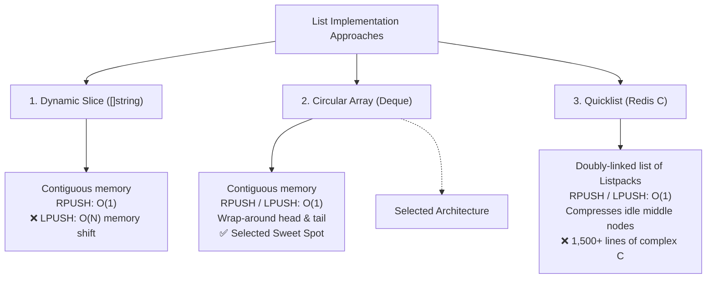

# Architecture Design Document: List Data Structure Trade-Offs

**Author:** Redis in Go Engineering  
**Subject:** List Data Structure Architecture, Memory Efficiency & Trade-Off Analysis  
**Status:** Approved / Decision Record  

---

## 1. Executive Summary

Redis lists represent ordered sequences of string elements supporting push and pop operations at both the head and tail (`LPUSH`, `RPUSH`, `LPOP`, `RPOP`), list length queries (`LLEN`), and range slices (`LRANGE`). 

In an in-memory database, list performance is governed not just by **CPU time complexity ($O(1)$ vs. $O(N)$)**, but equally by **RAM allocation overhead, memory fragmentation, and cache locality**.

This document evaluates three architectural choices for implementing Redis Lists:
1. **Standard Dynamic Array / Slice (`[]string`)** (Intuitive Brute-Force baseline)
2. **Resizing Circular Buffer / Array Deque** (Our Selected Architecture)
3. **Chunked Doubly-Linked List / Quicklist** (Production C Redis Architecture)

**Decision:** We adopt a **Resizing Circular Buffer (Array Deque)**. It achieves true $O(1)$ time complexity on both ends with contiguous memory performance and minimal code footprint (~60 lines of Go), avoiding the brute-force $O(N)$ memory copying of slices while bypassing the extreme implementation overhead of Redis's Quicklist.

---

## 2. Structural Overview of the Three Architectures



---

## 3. Deep Dive into the Three Approaches

---

### Strategy 1: Standard Dynamic Slice (`[]string`) — The Brute-Force Baseline

#### Mechanism
A standard Go slice backed by a single contiguous heap array. 

* **`RPUSH`**: Uses Go's built-in `append(slice, val)`. When capacity permits, writing to the tail is an amortized $O(1)$ operation.
* **`LPOP`**: Reslicing `slice = slice[1:]` increments the slice pointer in $O(1)$ time.
* **`LPUSH`**: To insert at index `0`, every existing element must be shifted right by one position:
  $$\text{slice} = \text{append}([]\text{string}\{\text{val}\}, \text{slice}\dots)$$

#### Time & Space Complexity:
* **`RPUSH` / `RPOP`**: Time $O(1)$ amortized, Space $O(1)$ auxiliary.
* **`LPOP`**: Time $O(1)$, Space $O(1)$.
* **`LPUSH`**: Time **$O(N)$**, Space **$O(N)$** allocation and memory copying.
* **`LRANGE`**: Time $O(R)$ (where $R$ is range length), Space $O(R)$ contiguous copy.

#### Evaluation:
* **The Intuition**: Extremely simple to write (zero custom data structures).
* **The Fatal Flaw**: Prepending to a slice with 100,000 items requires re-allocating and copying 100,000 pointers in RAM on *every single push*. It wastes CPU cycles and creates heavy Garbage Collection (GC) pressure.

---

### Strategy 2: Resizing Circular Buffer / Array Deque — Our Selected Architecture

#### Mechanism
A single contiguous backing array (`buf []string`) managed via two circular indices: `head` and `tail`, tracking the total element `count`.

```
Physical Buffer: [  _  |  _  | "a" | "b" | "c" |  _  |  _  ]
                          ▲                 ▲
                         head              tail
```

* **`RPUSH`**: Writes to `tail` and advances `tail = (tail + 1) % len(buf)` in $O(1)$ time.
* **`LPUSH`**: Decrements `head = (head - 1 + len(buf)) % len(buf)` and writes to `head` in $O(1)$ time.
* **`LPOP` / `RPOP`**: Advances the head/tail index and nils the slot to allow immediate GC in $O(1)$ time.
* **Dynamic Growth**: When `count == len(buf)`, the buffer capacity is doubled ($8 \to 16 \to 32 \to \dots$) and elements are unrolled sequentially.

#### Time & Space Complexity:
* **`LPUSH` / `RPUSH`**: Time **$O(1)$ amortized**, Space $O(1)$ auxiliary.
* **`LPOP` / `RPOP`**: Time **$O(1)$**, Space $O(1)$.
* **`LLEN`**: Time **$O(1)$** (instant return of `count`).
* **`LRANGE`**: Time **$O(R)$**, Space $O(R)$ (direct indexing via `(head + i) % cap`).
* **Total Space Complexity**: **$O(N)$** contiguous heap memory.

#### Evaluation:
* **Strengths**: 
  * Eliminates the $O(N)$ prepending bottleneck completely.
  * Preserves high **CPU L1/L2 cache locality** by keeping data in a flat, contiguous memory chunk.
  * Entirely self-contained in ~60 lines of clean Go.
* **Limitations**: 
  * Does not support mid-structure compression.
  * Resizing requires doubling a contiguous memory block.

---

### Strategy 3: Production Redis Quicklist — The Enterprise C Database Choice

#### Mechanism
In production Redis, lists are implemented as a **Quicklist** (`quicklist.c`): a doubly-linked list where each node contains a **Listpack** (a contiguous byte-packed memory buffer holding up to 32–64 elements or $\le 8\text{ KB}$).

```
    [ Node 1: 32 items ] <──────> [ Node 2: 32 items ] <──────> [ Node 3: 32 items ]
         (Head node)               (Compressed LZF)                (Tail node)
```

#### Time & Space Complexity:
* **`LPUSH` / `RPUSH`**: Time $O(1)$ amortized (inserts into head/tail node's small listpack).
* **`LPOP` / `RPOP`**: Time $O(1)$ (removes from head/tail node; frees node if empty).
* **`LINDEX`**: Time $O(\min(i, N - i))$ (skips nodes in $O(1)$ per node chunk).
* **`LINSERT` / `LREM`**: Time $O(M) \approx O(1)$ local shift inside a single 4 KB node; node splits if full.
* **Total Space Complexity**: $O(N)$, but with up to **75% RAM reduction** via LZF compression.

---

## 4. Why Production Redis Chose Quicklist Over Circular Arrays

A circular array (Deque) is computationally optimal for head and tail operations ($O(1)$), yet Redis deliberately rejected using a single circular array. The reasons are rooted entirely in **RAM management, memory allocators (`jemalloc`), and operating system constraints**:

### 1. The 2x Resizing Spike and OOM (Out-of-Memory) Failure
In a single circular array, memory must be contiguous. 
* Imagine a Redis list holding **10,000,000 items** consuming **500 MB** of RAM.
* When element #10,000,001 arrives, the array must double to **1 GB**.
* During reallocation, the OS memory allocator must hold the old 500 MB block **and** allocate the new 1 GB block simultaneously.
* **Total memory footprint during resize: 1.5 GB!**
* If the server has only 1.2 GB of free RAM, **Redis crashes with an Out-Of-Memory panic**.
* **Quicklist Solution**: Quicklist allocates tiny, fixed **4 KB chunks**. It never needs giant contiguous allocations, growing incrementally with zero memory spikes.

### 2. External Memory Fragmentation in Virtual Memory
Over long-running database processes, memory allocators develop fragmentation. Finding a contiguous block of 2 GB is difficult and frequently fails. Finding a 4 KB page is virtually guaranteed and produces zero fragmentation.

### 3. Inability to Compress Inactive Data in RAM
In production queues (e.g., Celery, BullMQ, Kafka-like pipelines):
* Pushes occur at the head, pops at the tail.
* **Millions of items in the middle sit completely idle for hours or days.**
* In a single circular array, **data cannot be compressed** because array indexing math requires uniform element offsets.
* In Quicklist, Redis activates **`list-compress-depth`**: the head and tail nodes remain uncompressed for $O(1)$ speed, while every middle node is compressed using **LZF lossless compression**. This slashes RAM costs on AWS/GCP by **up to 75%**.

### 4. Immediate Memory Deallocation on Pop
When a 5,000,000-item backlog is drained to 0 items:
* A circular array retains its massive allocated capacity unless expensive shrinking logic is executed.
* In Quicklist, as nodes empty, their 4 KB memory pages are **immediately freed back to the OS**.

---

## 5. Comprehensive Comparison Matrix

| Architectural Dimension | 1. Dynamic Slice (`[]string`) | 2. Circular Array (`Deque`) | 3. Redis Quicklist (C) |
| :--- | :--- | :--- | :--- |
| **`RPUSH` Time** | $O(1)$ amortized | **$O(1)$ amortized** | **$O(1)$ amortized** |
| **`LPUSH` Time** | ❌ **$O(N)$ (Shifts all items)** | **$O(1)$ amortized** | **$O(1)$ amortized** |
| **`LPOP` / `RPOP` Time** | $O(1)$ | **$O(1)$** | **$O(1)$** |
| **`LLEN` Time** | $O(1)$ | **$O(1)$** | **$O(1)$** |
| **`LRANGE` Time** | $O(R)$ | **$O(R)$** | $O(S + R)$ |
| **Middle Edits (`LINSERT`)** | $O(N)$ | $O(N)$ | **$O(M) \approx O(1)$** (Local split) |
| **Memory Growth Pattern** | Contiguous doubling | Contiguous doubling | **Incremental 4 KB chunks** |
| **Peak Resize Memory Spike** | $2\times$ memory spike | $2\times$ memory spike | **Zero spike ($+4\text{ KB}$)** |
| **Memory Fragmentation** | High on large datasets | High on large datasets | **Near Zero** |
| **RAM Compression** | ❌ None | ❌ None | **✅ LZF on middle nodes (75% savings)** |
| **CPU Cache Locality** | Excellent (Contiguous) | **Excellent (Contiguous)** | Moderate (Chunk contiguous) |
| **Implementation Lines** | ~10 lines | **~60 lines (Clean Go)** | 1,500+ lines (Complex C) |

---

## 6. Architectural Decision: The Circular Deque Sweet Spot

For our Go-based Redis server, we choose **Architecture 2: Resizing Circular Buffer (Deque)**.

### Rationale:
1. **Algorithmic Correctness**: Solves the brute-force $O(N)$ prepend bottleneck, delivering true $O(1)$ performance across `LPUSH`, `RPUSH`, `LPOP`, and `RPOP`.
2. **Pragmatic Complexity**: Avoids the 1,500+ lines of complex pointer arithmetic, node-splitting, and page-merging logic required by Quicklist (which mirrors a BusTub B+ Tree leaf chain).
3. **Hardware Efficiency**: Retains modern CPU cache line efficiency ($64\text{ B}$ L1 prefetching) by maintaining flat contiguous storage in Go.
4. **Clean Abstraction**: Encapsulates all circular math inside a dedicated struct, presenting a simple, idiomatic API to the `Store`.

---

## 7. Reference Implementation

```go
package main

// Deque implements a double-ended queue using a circular ring buffer.
type Deque struct {
	buf   []string
	head  int
	tail  int
	count int
}

func NewDeque() *Deque {
	return &Deque{
		buf: make([]string, 8), // Initial capacity of 8
	}
}

func (d *Deque) Len() int {
	return d.count
}

// grow doubles capacity and normalizes elements sequentially.
func (d *Deque) grow() {
	newBuf := make([]string, len(d.buf)*2)
	for i := 0; i < d.count; i++ {
		newBuf[i] = d.buf[(d.head+i)%len(d.buf)]
	}
	d.buf = newBuf
	d.head = 0
	d.tail = d.count
}

// PushBack (RPUSH) in O(1) amortized time.
func (d *Deque) PushBack(val string) {
	if d.count == len(d.buf) {
		d.grow()
	}
	d.buf[d.tail] = val
	d.tail = (d.tail + 1) % len(d.buf)
	d.count++
}

// PushFront (LPUSH) in O(1) amortized time.
func (d *Deque) PushFront(val string) {
	if d.count == len(d.buf) {
		d.grow()
	}
	d.head = (d.head - 1 + len(d.buf)) % len(d.buf)
	d.buf[d.head] = val
	d.count++
}

// PopFront (LPOP) in O(1) time.
func (d *Deque) PopFront() (string, bool) {
	if d.count == 0 {
		return "", false
	}
	val := d.buf[d.head]
	d.buf[d.head] = "" // Allow GC to reclaim string memory
	d.head = (d.head + 1) % len(d.buf)
	d.count--
	return val, true
}

// PopBack (RPOP) in O(1) time.
func (d *Deque) PopBack() (string, bool) {
	if d.count == 0 {
		return "", false
	}
	d.tail = (d.tail - 1 + len(d.buf)) % len(d.buf)
	val := d.buf[d.tail]
	d.buf[d.tail] = "" // Allow GC to reclaim string memory
	d.count--
	return val, true
}

// Range (LRANGE) extracts elements in logical index range in O(R) time.
func (d *Deque) Range(start, stop int) []string {
	if start < 0 { start = d.count + start }
	if stop < 0  { stop = d.count + stop }

	if start < 0 { start = 0 }
	if stop >= d.count { stop = d.count - 1 }

	if start >= d.count || start > stop {
		return []string{}
	}

	result := make([]string, stop-start+1)
	for i := 0; i < len(result); i++ {
		physicalIdx := (d.head + start + i) % len(d.buf)
		result[i] = d.buf[physicalIdx]
	}
	return result
}
```
